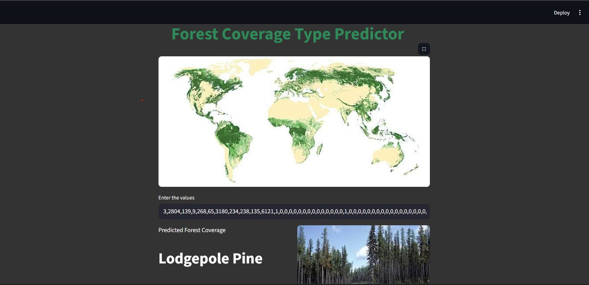

# 🌲 Forest Coverage Type Predictor

This project predicts the **type of forest cover** based on terrain and environmental features using **machine learning models** trained on the Forest Cover dataset.  
It includes both a **model training notebook**, **Streamlit web app** & a **Docker image** code for easy prediction, visualization & Deployment.

---

## 🚀 Features

- Performs **Exploratory Data Analysis (EDA)** on the dataset  
- Model - XGBoost  
- Uses **RandomizedSearchCV** for hyperparameter tuning  
- Achieves around **90% accuracy**  
- Saves and loads the trained model using **pickle**  
- Provides a **Streamlit web interface** to predict forest cover type from user input
- Deployed of **Dockerhub** as a Docker image
- Displays related **forest image and name** after prediction

---

## 🧠 Tech Stack

- **Python**
- **Streamlit** – Web app interface  
- **Scikit-learn** – Model training and evaluation  
- **XGBoost** – Gradient boosting classifier  
- **Matplotlib & Seaborn** – Visualization  
- **Pandas & NumPy** – Data processing  
- **Pickle** – Model serialization  
- **TensorFlow** – Optional imports (not used directly in final model)

---
## Docker

Could be pulled from Docker by using :
`docker pull 4ffan/forestcoverage`

---

## 📂 Project Structure
    📁 Forest_Cover_Predictor
    │
    ├── forest_cover.csv              # Dataset
    ├── Forest_cover_model.sav        # Trained model (saved)
    ├── mainimage2.jpg                # Header image for Streamlit
    ├── images/                       # Folder for forest type images
    │   ├── Spruce,Fir.jpg
    │   ├── Lodgepole.jpg
    │   ├── Ponderosa.jpg
    │   ├── Cottonwood,Willow.jpg
    │   ├── Aspen.jpg
    │   ├── Douglas.jpg
    │   └── Krummholz.jpg
    │
    ├── train_model.py                # Data analysis & model training script
    ├── app.py                        # Streamlit app
    └── README.md     
